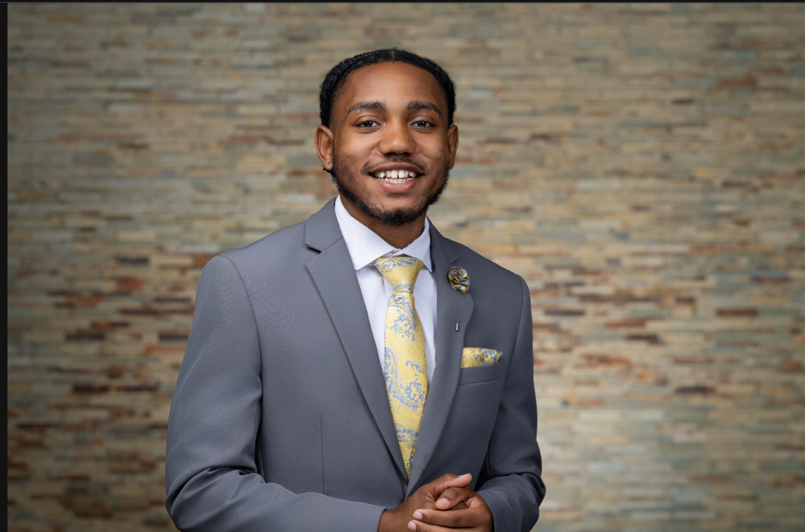

# Solomon Rayton
Aspiring Systems Engineer and Technical Project Leader focused on cybersecurity, infrastructure, AI systems, and mission-driven technology.

---
# About Me

I’m a Computer Science student at Fort Valley State University focused on systems engineering, cybersecurity operations, and mission-driven technology leadership.

My experience spans enterprise IT support, explainable AI research, infrastructure troubleshooting, and technical problem-solving in fast-paced operational environments. Long term, I aim to grow into systems engineering and technical program leadership roles where I can bridge technology, operations, and strategy particularly within nonprofit, public-sector, and social impact organizations.

---

# Technical Interests
* Systems Engineering
* Cybersecurity Operations
* Infrastructure Technologies
* AI & Data Analytics
* Technical Project Leadership
* Cloud & Network Systems
* Mission-Driven Technology
---

# Current Focus
* Enterprise IT Support
* Explainable AI Research
* Linux & Infrastructure Fundamentals
* Cybersecurity Operations
* Technical Leadership Development
---

# Featured Projects
## Explainable AI for Heart Risk Prediction

* Machine learning research project using SHAP and LIME to improve transparency and interpretability in healthcare risk prediction models.

## FMV Object Detection & Geospatial Tracking

* Real-time object tracking system integrating OpenCV, YOLOv5, Flask, and Leaflet for geospatial visualization.

## Carbon Footprint Calculator

* Hackathon sustainability project focused on estimating environmental impact through user behavior analytics.

# Leadership & Involvement
TMCF Scholar - Cybersecurity Club Executive Board - FVSU Royal Court Representative - Undergraduate Research Assistant
---
# Connect
* [Email](srayton@wildcat.fvsu.edu)
* [LinkedIn](https://www.linkedin.com/in/solomon-rayton/)
* [PIN](https://pingeorgia.org/team/solomon-rayton/)
